                                                                                                                                                                                                                                                                                             

    

# Top th Pakistani Github Contributor  

 

 
   

 <h1 align="center">
    
    
</h1>

  

  

 

  

  

  

  

  

 

## **Empowering Minds through Code**  

##  TECH SESSIONS – Volunteer Teaching

| Session | Status |
|----------------------------------------------------------------------------------------------------|-------------------------------------------------------------------------------------------------------|
| <a href="https://www.linkedin.com/posts/esha-tariqdev_dsa-leetcode-slidingwindow-activity-7402732987945054211-rxAn?utm_source=share&utm_medium=member_desktop&rcm=ACoAAET0-qIBzXPQjrQe2J3E9xTPuf6cEQ71D3w" target="_blank" rel="noopener noreferrer">11PM Mastering DSA Advance</a> |  <b><a href="https://www.youtube.com/playlist?list=PLe-jr3hh4N_koNNfiYM1sclbsGXTZBBqs">Completed</a></b> |
| <a href="https://www.linkedin.com/posts/esha-tariqdev_dsa-grind75-leetcode-activity-7385570814575775744-PDag?utm_source=share&utm_medium=member_desktop" target="_blank" rel="noopener noreferrer">7AM PKT DSA Grind 75 LeetCode</a> |  <b><a href="https://www.youtube.com/live/lppfUuNRsxg?si=px5nmsEGk78awQYz">Completed</a></b> |
| <a href="https://github.com/codewithEshaYoutube/-11-PM-PKT-Data-Structures-Algorithms-Intermediate/blob/main/README.md" target="_blank" rel="noopener noreferrer">11PM Data Structures & Algorithms</a> | <b><a href="https://www.linkedin.com/posts/esha-tariqdev_dsa-codinginterviewprep-icodeguru-activity-7357117161653305344-AdvI">Completed</a></b> |
| <a href="https://github.com/codewithEshaYoutube/2pm_Mastering_DSA_For_Beginners_Course/blob/main/README.md" target="_blank" rel="noopener noreferrer">2PM Mastertering DSA For Beginners Course</a> |  <b><a href="https://www.linkedin.com/posts/esha-tariqdev_dsa-python-codewithesha-activity-7350173195594825728-4q4i">Completed</a></b> |
| <a href="https://www.linkedin.com/posts/esha-tariqdev_dsa-algorithms-coding-activity-7299145775840686081-xmXC" target="_blank" rel="noopener noreferrer">Data Structures for Beginners 1.0</a> | <b><a href="https://www.linkedin.com/posts/esha-tariqdev_dsasessions-learningjourney-gratitude-activity-7314356100860981248-nnb9" target="_blank" rel="noopener noreferrer">Completed</a></b> |

---

## 🎓 STANFORD UNIVERSITY – Code in Place 2025

| Role & Course                                                                                                         | Status | Credential |
| :-------------------------------------------------------------------------------------------------------------------- | :----: | :--------: |
| [Code in Place Section Leader @ Stanford University – CS106A (Python Fundamentals Trainer)](https://github.com/codewithEshaYoutube/Stanford_Code_In_Place) | [Completed](https://www.linkedin.com/posts/esha-tariqdev_codeinplace-stanfordcip-pythonlearning-activity-7334268281068969984-Fp4-?utm_source=share&utm_medium=member_desktop&rcm=ACoAAET0-qIBzXPQjrQe2J3E9xTPuf6cEQ71D3w) | 🎖️ [Stanford Verified Digital Credential](https://digitalcredential.stanford.edu/check/68D4A9D4F7D8950EC46ED44D73066D0D52735F6086C003AD37A11735E1A4D5A5dmdhTEFKZkxOeFdGekszZDZaSXZLQ2VuTWoxWkZFbGhGQktuazVSOFpXY01yZFYw) |

---
- **I'm Esha Tariq** — a Tech Trainer and Software Engineer passionate about AI and innovation.  

- **[@Codingal](https://www.codingal.com)** (YC W21) – Global Coding Instructor teaching Python , Web development , App development and logic to K–12 students from the US, Australia, UAE, Canada, and India. → [ View Teaching Portfolio](https://github.com/codewithEshaYoutube/Codingal)

- **See My Training** → **[**Recordings 👀**](https://github.com/codewithEshaYoutube/Volunteer_Teaching_Recordings)**- [Student Feedback:]( https://www.linkedin.com/posts/ghalib-ali-8a99022b4_leetcode-problemsolving-criticalthinking-activity-7408987919757045761-MSj5)
.
  
- **[@MITIT Coding Competition](https://www.linkedin.com/posts/esha-tariqdev_mit2-techcompetition-codewarriors-activity-7287064089481154560-096R/)**: Participated in MITIT Coding Contest Cup **2025** where my team solved challenging problems and ranked 104th.
- **[Meta Hacker Cup 2025](https://www.facebook.com/codingcompetitions/hacker-cup/)** — [Advanced](https://github.com/codewithEshaYoutube/Meta_Hacker_Cup_2025) from **Practice Round → Round 1 → Round 2** in Meta’s global competitive programming challenge, placing among the **[top 5% worldwide](https://www.linkedin.com/posts/esha-tariqdev_metahackercup-meta-competitiveprogramming-activity-7386712082752294915-8qS1?utm_source=share&utm_medium=member_desktop&rcm=ACoAAET0-qIBzXPQjrQe2J3E9xTPuf6cEQ71D3w)**, demonstrating advanced algorithmic and problem-solving expertise. 

- **[@CS50x Puzzle Day 2025](https://www.linkedin.com/posts/esha-tariqdev_cs50-puzzleday-problemsolving-activity-7314299663879221248-wS5h?utm_source=share&utm_medium=member_desktop&rcm=ACoAAET0-qIBzXPQjrQe2J3E9xTPuf6cEQ71D3w)** - [Participated](https://github.com/codewithEshaYoutube/Harvard_CS50x_Puzzle_Day_2025) in Harvard's global logic and problem-solving challenge with a diverse international team and **[won  by solving 9/9 puzzles](https://www.linkedin.com/posts/esha-tariqdev_cs50x-puzzleday2025-catchmeifyoucan-activity-7316545991527038978-HkHU?utm_source=share&utm_medium=member_desktop&rcm=ACoAAET0-qIBzXPQjrQe2J3E9xTPuf6cEQ71D3w) securing 1st position**! 🏆  
  

- **[@Stanford Code in Place 2025](https://codeinplace.stanford.edu/)** - [Selected](https://www.linkedin.com/posts/esha-tariqdev_codeinplace-stanforduniversity-sectionleader2025-activity-7316534267864346624-WdH_?utm_source=share&utm_medium=member_desktop&rcm=ACoAAET0-qIBzXPQjrQe2J3E9xTPuf6cEQ71D3w) to serve as a [**Section Leader(Trainer)**](https://github.com/codewithEshaYoutube/Stanford_Code_In_Place) for **Code in Place 2025**, a global teaching program by Stanford University, where I'll mentor students worldwide and help deliver Stanford's CS106A curriculum.

 

- **[@UC Berkeley CALICO Spring 2025](https://github.com/codewithEshaYoutube/UC_Berkley_CALICO_Spring-25/)**: [Participated](https://www.linkedin.com/posts/esha-tariqdev_ucberkeley-calicospring2025-globalcodingchallenge-activity-7322124227514368001-HKew?utm_source=share&utm_medium=member_desktop&rcm=ACoAAET0-qIBzXPQjrQe2J3E9xTPuf6cEQ71D3w) in UC Berkeley's Global Coding Challenge **CALICO Spring 2025**, where my team *Runtime Terror* solved multiple AI-proof hard problems and ranked **86th internationally**.
- **[@NASA Space Apps Challenge 2025](https://www.spaceappschallenge.org/2025/find-a-team/orbitx-engineers/?tab=project)** – [Presented ](https://www.linkedin.com/posts/esha-tariqdev_nasa-spaceapps2025-orbitxengineers-activity-7380915215766421504-LHiL?utm_source=share&utm_medium=member_desktop&rcm=ACoAAET0-qIBzXPQjrQe2J3E9xTPuf6cEQ71D3w) the project as a global solution [**AgriVerse**](https://saqlain143.github.io/AgriVerse/),  leveraging AI for sustainable agriculture, as part of [**Team OrbitX Engineers**](https://github.com/codewithEshaYoutube/NASA_SPACE_APP_CHALLENGE_2025/) at NASA’s international hackathon. 
- **[@ICPC Asia Topi Regional 2025](https://icpc.global/)** — Participated as **Team The Optimizers** representing my university in this prestigious competitive programming contest.[Proof](https://www.linkedin.com/posts/esha-tariqdev_icpcasiatopiregional-programmingcompetition-activity-7402721418460778496-15U_?utm_source=share&utm_medium=member_desktop&rcm=ACoAAET0-qIBzXPQjrQe2J3E9xTPuf6cEQ71D3w)

-  **[@CSGirlies](https://www.csgirlies.com/)** – [Winner🏆](https://www.linkedin.com/posts/esha-tariqdev_finaura-fintech-agenticai-activity-7355858231094620160-c4SA?utm_source=share&utm_medium=member_desktop&rcm=ACoAAET0-qIBzXPQjrQe2J3E9xTPuf6cEQ71D3w) of the **Chaotic Genius Prize** at a U.S.-hosted Hackathon with the project **FinAura**, an Agentic AI financial assistant for Gen Z money management using GPT-4, LangChain, and FastAPI.

- **[@Lablab.ai](https://lablab.ai/)** – [Winner🏅](https://www.linkedin.com/posts/esha-tariqdev_raiseyourhack-aptivaai-vhealai-activity-7348811576713326593-Q0ma/) at the **RAISE Your Hack** Hackathon (RAISE Summit 2025, Paris) for **VHeal AI**, an Agentic AI hospital discharge copilot with real-time triage and care plans.
- **[@Advent of Code 2025](https://adventofcode.com/)** — [Completed the full December series](https://www.linkedin.com/posts/esha-tariqdev_adventofcode-codingchallenge-softwareengineering-activity-7405246557706592256-KfsE?utm_source=share&utm_medium=member_desktop&rcm=ACoAAET0-qIBzXPQjrQe2J3E9xTPuf6cEQ71D3w), earning **[all 24 stars](https://github.com/codewithEshaYoutube/Advent_of_Code_Competition)** through **daily coding challenges**, ranking **Top 3 nationally (Females)**, **Top 15 nationally**, and **Top 18 internationally**.

- **[@Lablab.ai](https://lablab.ai/u/@eesha_tariq899)** – [Participated](https://lablab.ai/u/@eesha_tariq899) in **12 X global AI hackathons** with **2X International Hackathon Wins**, building Agentic AI apps using GPT-4, FastAPI, Redis, and Streamlit.

- **[@Typing Speed](https://www.linkedin.com/posts/esha-tariqdev_typingskills-productivity-efficiency-activity-7383419702238396417-CbaL?utm_source=share&utm_medium=member_desktop&rcm=ACoAAET0-qIBzXPQjrQe2J3E9xTPuf6cEQ71D3w)**: 70 WPM — boosts efficiency in implementing and testing AI models.  

- Worked as Full Stack Developer at South Xclusive Properties (UAE), Vialogic (United Kingdom), Wallafan (Spain), Gutech International LLC (United States)

## Some Community Projects & Resources
| Project :octocat:                                                                                              | Issues :bug:                                                                                                                                                                                                        | Open PRs :bell:                                                                                                                                                                                         | Closed PRs :fire:                                                                                                                                                                                                                                     |
| ------------------------------------------------------------------------------------------------------------ | ------------------------------------------------------------------------------------------------------------------------------------------------------------------------------------------------------------------- | ------------------------------------------------------------------------------------------------------------------------------------------------------------------------------------------------------- | --------------------------------------------------------------------------------------------------------------------------------------------------------------------------------------------------------------------------------------------------- |
| [**Tech Books**](https://github.com/codewithEshaYoutube/Tech-Books)                                              |                              |                                           |   |
| [**Learn Python Data Analytics in 3 Months**](https://github.com/codewithEshaYoutube/Corvit_Python_Data_Analytics_Course)  |  |  |  |
| [**Hire Genius AI**](https://github.com/codewithEshaYoutube/HireGenius_Ai)                                        |                         |                             |                              |
| [**Wave Tracker**](https://github.com/codewithEshaYoutube/wave-tracker)                                          |                             |                                |                              |
| [**Learn Python in 2 Months**](https://github.com/codewithEshaYoutube/Python-CS50)                               |                            |                                 |                               |

<!--   ## Consistency👨‍💻
  

  

  
&nbsp;
  -->

<a href="https://www.upwork.com/freelancers/eeshat3" target="_blank" style="
  display: inline-block;
  background-color: #0077b5;
  color: white;
  padding: 10px 20px;
  border-radius: 25px;
  text-align: center;
  text-decoration: none;
  font-size: 16px;
  font-weight: bold;
  cursor: pointer;
  box-shadow: 0 4px 6px rgba(0, 0, 0, 0.1);
  transition: transform 0.2s, box-shadow 0.2s;
">
  🚀 Hire Me on Upwork

<h1 align="left">
   Tech Stack and Tools
</h1>

<table style="border-collapse: collapse; width: 100%; max-width: 900px; margin: 20px auto; font-family: Arial, sans-serif;">
  <tr>
    <!-- JavaScript, CSS, HTML -->
    <!-- Python and Python tools -->
    <td align="center" style="padding: 12px;">
       Python
    </td>
    <td align="center" style="padding: 12px;">
       Pandas
    </td>
    <td align="center" width="96">
  
   Generative AI
</td>
    <td align="center" style="padding: 12px;">
       Matplotlib
    </td>
    <td align="center" style="padding: 12px;">
       Scikit-learn
    </td>
    <td align="center" style="padding: 12px;">
       TensorFlow
    </td>
    <td align="center" style="padding: 12px;">
       GitHub
    </td>
    <td align="center" style="padding: 12px;">
       Git
    </td>
    <td align="center" style="padding: 12px;">
       MySQL
    </td>
  </tr>

  <tr>
    <td align="center" style="padding: 12px;">
       JavaScript
    </td>
    <td align="center" style="padding: 12px;">
       CSS3
    </td>
    <td align="center" style="padding: 12px;">
       HTML5
    </td>
    <td align="center" style="padding: 12px;">
       TailwindCSS
    </td>
    <td align="center" style="padding: 12px;">
       Vite
    </td>
    <td align="center" style="padding: 12px;">
       React
    </td>
    <td align="center" style="padding: 12px;">
       MongoDB
    </td>
    <td align="center" style="padding: 12px;">
       Figma
    </td>
    <td align="center" style="padding: 12px;">
       Streamlit
    </td>
  </tr>

  
    
  

  <tr>
    <td align="center" style="padding: 12px;">
       NumPy
    </td>
    <td align="center" style="padding: 12px;">
       Slack
    </td>
    <td align="center" style="padding: 12px;">
       Seaborn
    </td>
    <td align="center" style="padding: 12px;">
       Keras
    </td>
    <td align="center" style="padding: 12px;">
       FastAPI
    </td>
    <td align="center" style="padding: 12px;">
       BeautifulSoup
    </td>
    <td align="center" style="padding: 12px;">
       Scrapy
    </td>
    <td align="center" style="padding: 12px;">
       Postman
    </td>
    <td align="center" style="padding: 12px;">
        Scratch
    </td>
  </tr>
 
</table>
<h1>
  
  My Stats
</h1>
 

## GitHub Code Contributions & Language Proficiency

<!-- YouTube -->

<!-- GitHub General Stats -->

<!-- Top Languages -->

## Completed International Hackathons🥇

  <a href="https://www.linkedin.com/posts/esha-tariqdev_mit2-techcompetition-codewarriors-activity-7287064089481154560-096R?utm_source=share&utm_medium=member_desktop" target="_blank">
    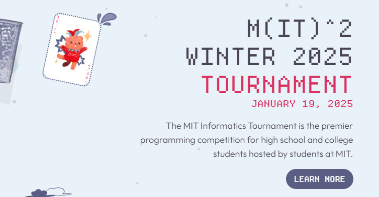
  </a>

  

  

  <a href="https://www.linkedin.com/posts/esha-tariqdev_hiregeniusai-deepseekai-aijobs-activity-7296944638962114560-ajzC?utm_source=share&utm_medium=member_desktop" target="_blank">
    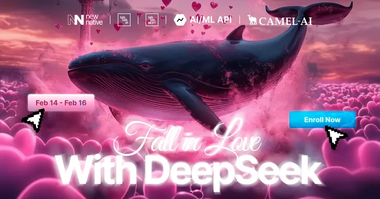
  </a>

  

  <a href="https://www.linkedin.com/posts/esha-tariqdev_cs50-puzzleday-problemsolving-activity-7314299663879221248-wS5h?utm_source=share&utm_medium=member_desktop" target="_blank">
    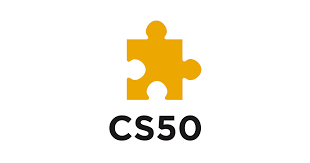
  </a>

  

  

  <a href="https://www.linkedin.com/posts/esha-tariqdev_raiseyourhack-aptivaai-vhealai-activity-7348811576713326593-Q0ma?utm_source=share&utm_medium=member_desktop" target="_blank">
    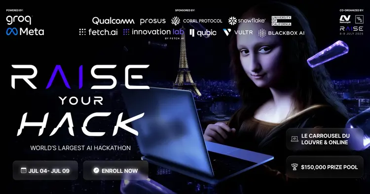
  </a>

  <a href="https://www.linkedin.com/posts/esha-tariqdev_gpt5hackathon-agentica-aiagents-activity-7366163591009390592-mtbf?utm_source=share&utm_medium=member_desktop" target="_blank">
    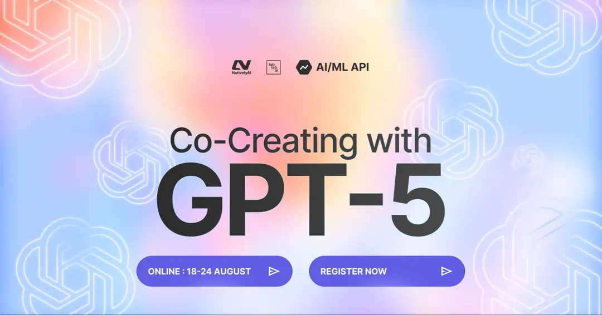
  </a>

  <a href="https://www.linkedin.com/posts/esha-tariqdev_ai-fintech-agenticai-activity-7355295096650530816-ZPnM?utm_source=share&utm_medium=member_desktop" target="_blank">
    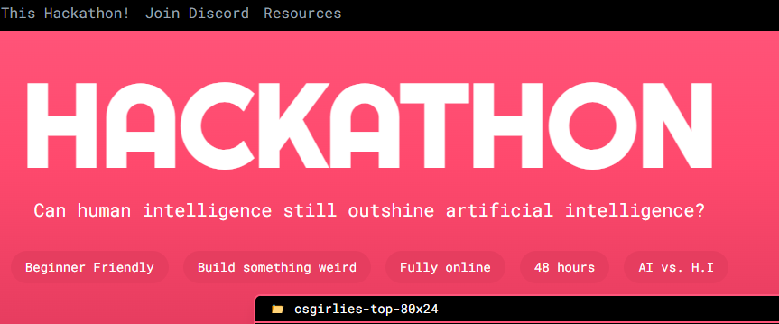
  </a>

  <a href="https://www.linkedin.com/posts/esha-tariqdev_neuraviahacks2025-aiforgood-hackathon-activity-7366167862064902144-oALt?utm_source=share&utm_medium=member_desktop" target="_blank">
    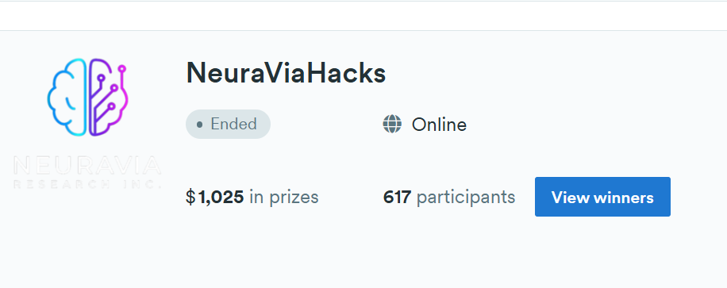
  </a>

  <a href="https://www.linkedin.com/posts/esha-tariqdev_ai-linkedin-hackathon-activity-7375983047143211008-vE79?utm_source=share&utm_medium=member_desktop" target="_blank">
    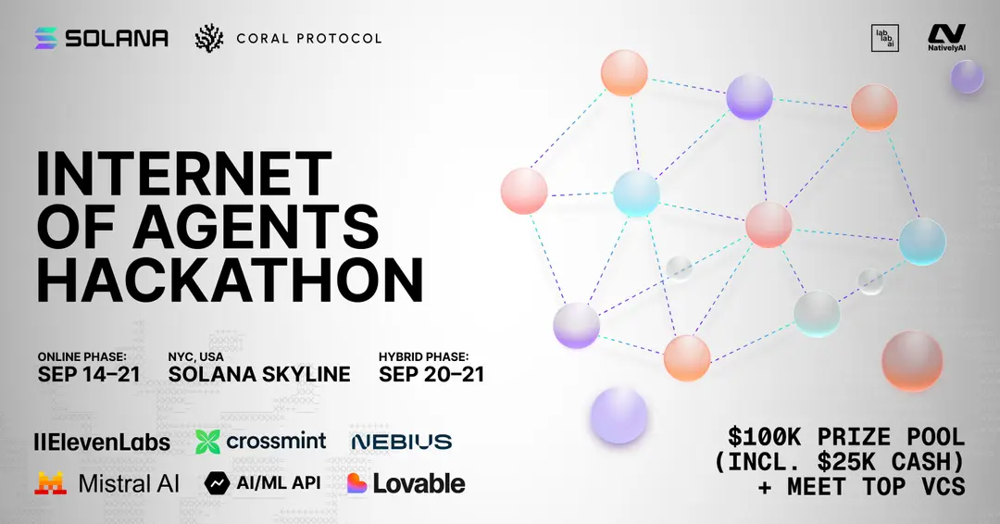
  </a>

  <a href="https://www.linkedin.com/posts/esha-tariqdev_neuraviahacks2025-aiforgood-hackathon-activity-7366167862064902144-oALt?utm_source=share&utm_medium=member_desktop" target="_blank">
    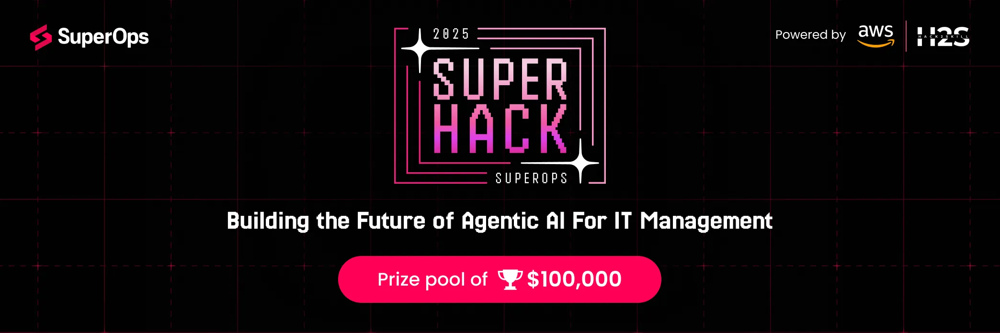
  </a>

  <a href="https://www.linkedin.com/posts/esha-tariqdev_%F0%9D%90%85%F0%9D%90%AB%F0%9D%90%A8%F0%9D%90%A6-%F0%9D%90%AC%F0%9D%90%9A%F0%9D%90%AD%F0%9D%90%9E%F0%9D%90%A5%F0%9D%90%A5%F0%9D%90%A2%F0%9D%90%AD%F0%9D%90%9E%F0%9D%90%AC-%F0%9D%90%AD%F0%9D%90%A8-%F0%9D%90%AC-activity-7380915215766421504-kdyV?utm_source=share&utm_medium=member_desktop" target="_blank">
    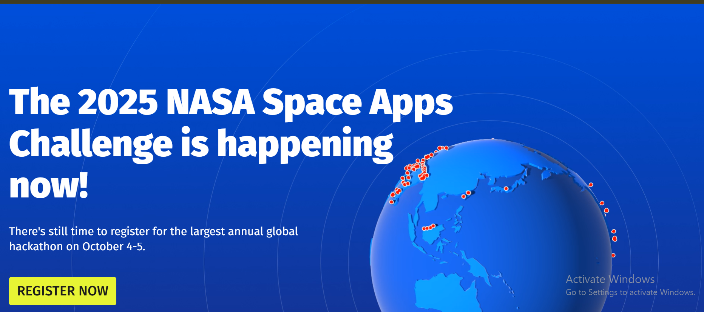
  </a>

  <a href="https://www.linkedin.com/posts/esha-tariqdev_metahackercup-meta-competitiveprogramming-activity-7386712082752294915-8qS1?utm_source=share&utm_medium=member_desktop" target="_blank">
    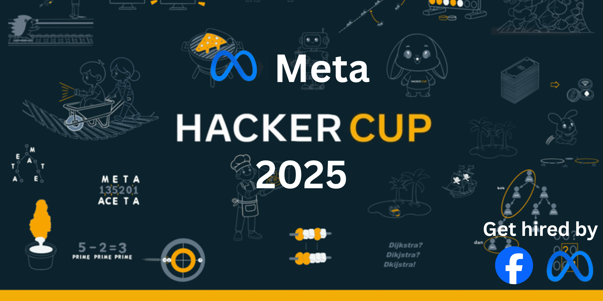
  </a>

  <a href="https://www.linkedin.com/posts/esha-tariqdev_metahackercup-meta-competitiveprogramming-activity-7386712082752294915-8qS1?utm_source=share&utm_medium=member_desktop" target="_blank">
    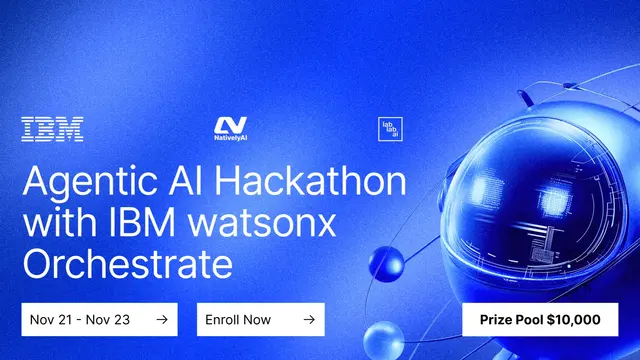
  </a>

     

<h3 align="center">
    
</h3>
